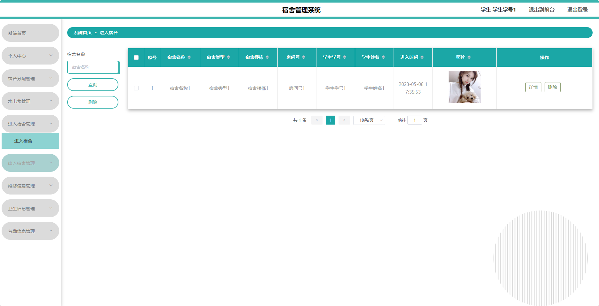

基于SpringBoot的宿舍管理系统（程序+论文）
=
- 完整代码获取地址：从戎源码网 ([https://armycodes.com/](https://armycodes.com/))
- 作者微信：19941326836  QQ：952045282 
- 承接计算机毕业设计、Java毕业设计、Python毕业设计、深度学习、机器学习
- 选题+开题报告+任务书+程序定制+安装调试+论文+答辩ppt 一条龙服务
- 所有选题地址https://github.com/nature924/allProject

一、项目介绍
---
基于Spring Boot框架实现的宿舍管理系统，系统包含两种角色：管理员、用户,系统分为前台和后台两大模块，主要功能如下。

### 前台：
- 首页：展示系统的概览信息。
- 交流论坛：提供师生交流、学习讨论的平台。
- 宿舍公告：展示宿舍相关的通知公告。
- 留言板：用于学生之间或者学生与管理员之间留言沟通的板块。
- 个人中心：用户可以登录后进入个人中心，管理个人信息，查看个人的宿舍分配情况，水电费账单，考勤记录等。

### 后台：
### 用户角色：
- 系统首页：展示系统的整体数据统计。
- 个人中心：用户可以管理个人信息，修改密码等。
- 宿舍分配管理：用户可以申请宿舍、查询宿舍分配情况等。
- 水电费管理：用户可以查询水电费账单、缴纳水电费等。
- 进入宿舍管理：用户可以记录自己进入宿舍的时间，进行出入登记等。
- 出入宿舍管理：用户可以查看自己的出入宿舍记录。
- 维修信息管理：用户可以提交宿舍内的维修请求，查看维修进度等。
- 卫生信息管理：用户可以提交宿舍卫生情况，查看卫生检查记录等。
- 考勤信息管理：用户可以查看个人的考勤记录、请假情况等。

### 管理员角色：
- 个人中心：管理员可以管理个人信息，修改密码等。
- 学生管理：管理员可以对学生信息进行增删改查等操作。
- 宿舍信息管理：管理员可以管理宿舍的基本信息，包括宿舍楼栋、房间号等。
- 宿舍分配管理：管理员可以对学生的宿舍分配情况进行管理和调整。
- 水电费管理：管理员可以管理水电费的账单生成、缴费记录等。
- 进入宿舍管理：管理员可以对学生进入宿舍的记录进行管理和审核。
- 出入宿舍管理：管理员可以查看和管理学生的出入宿舍记录。
- 维修信息管理：管理员可以处理宿舍维修请求，安排维修任务等。
- 卫生信息管理：管理员可以对宿舍卫生情况进行检查、记录和处理。
- 考勤信息管理：管理员可以查看学生的考勤情况，处理请假申请等。
- 留言板：管理员可以查看和管理留言板上的留言内容。
- 交流论坛：管理员可以管理交流论坛的帖子、评论，审核内容等。
- 系统管理：管理员可以管理系统的一些通用配置，例如系统参数设置、权限管理等。

二、项目技术
---
- 编程语言：Java
- 数据库：MySQL
- 项目管理工具：Maven
- 前端技术：VUE、HTML、Jquery、Bootstrap
- 后端技术：Spring、SpringMVC、MyBatis

三、运行环境
---
- 操作系统：Windows、macOS都可以
- JDK版本：JDK1.8以上都可以
- 开发工具：IDEA、Ecplise、Myecplise都可以
- 数据库: MySQL5.7以上都可以
- Tomcat：任意版本都可以
- Maven：任意版本都可以

四、运行截图
---
### 论文截图：

### 程序截图：

